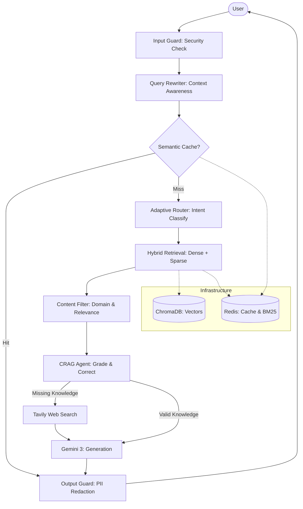
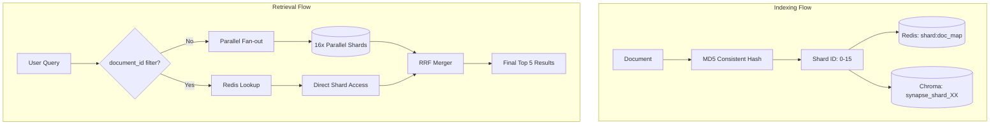
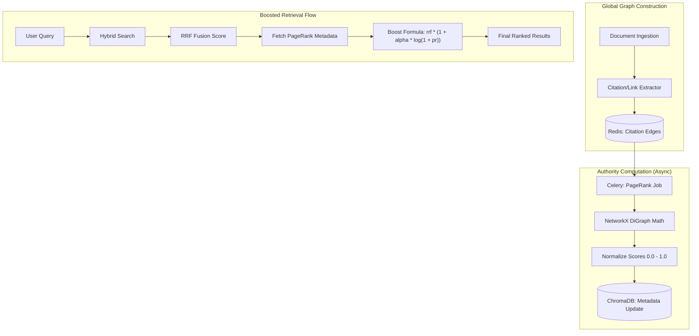

# 🧠 Synapse

> **Enterprise Agentic RAG — Built for Scale, Accuracy, and Trust**

An enterprise-grade, high-performance Retrieval-Augmented Generation monorepo powered by **Google Gemini 3**. Synapse features advanced agentic workflows, self-healing retrieval, and multi-layer security — designed to handle millions of documents with citation-accurate answers.


---

## 🏗️ System Architecture



### 🗄️ Multi-Tenant Sharding Architecture

Synapse uses a custom consistent hashing sharding layer to scale to 100M+ documents while maintaining low latency.



### 📈 PageRank Authority Architecture

Synapse leverages a global citation graph to inject objective authority scores into the vector search pipeline, overcoming the limitations of pure semantic similarity.



---

## 🌟 Key Features

### 🧠 Agentic Intelligence
- **Corrective RAG (CRAG)**: Self-correcting retrieval loop that grades document relevance and triggers Tavily web search fallback for missing information
- **Adaptive Router**: Zero-shot query classification to dynamically adjust retrieval parameters (Top-K, prompting strategy) based on user intent
- **Query Decomposition**: Automatically breaks complex, multi-hop questions into precise sub-queries for higher recall

### ⚡ Performance & Scale
- **Hybrid Retrieval**: Combined Dense (HNSW) and Sparse (BM25) search fused with Reciprocal Rank Fusion (RRF)
- **PageRank Authority Boosting**: Offline graph-based scoring (networkx) integrated into retrieval via a dampened log-boost formula.
- **Authority Mode**: Query-time ranking override to prioritize highly-cited authoritative documents.
- **Semantic Cache**: Sub-millisecond similarity caching via RediSearch vector indexing
- **Context Awareness**: Redis-backed conversation memory with intelligent query rewriting for multi-turn dialogues

### 🛡️ Enterprise Security
- **Input Guard**: Ultra-fast (<1ms) regex-based protection against prompt injection, SQLi, and path traversal
- **Content Filter**: Domain allowlisting and similarity-based relevance validation for retrieved context
- **Output Guard**: Automated PII redaction via Microsoft Presidio (Email, SSN, Phone, CC numbers)

### 📊 Observability
- **Opik Integration**: Full pipeline tracing with latency metrics and model traces at every step
- **Retrieval Debugger**: Dedicated UI for inspecting raw scores across Dense, Sparse, RRF, and PageRank stages, including real-time visualization of authority boosting.

---

## 🛠️ Tech Stack

| Layer | Technology |
|---|---|
| Core | Python 3.10+, FastAPI, Next.js 15, TypeScript |
| AI | Google Gemini 3 (Flash & Pro), LangChain, Sentence-Transformers |
| Vector DB | ChromaDB (dev) → Qdrant cluster (prod) |
| Cache / Memory | Redis + RediSearch |
| UI | Tailwind CSS, shadcn/ui, Framer Motion |
| DevOps | Docker, Docker Compose |

---

## 📂 Project Structure

```text
Synapse/
├── agents/             # Agentic layer (CRAG, adaptive router, tools)
├── app/                # FastAPI core (lifespan, middleware, models)
├── chroma_db/          # Persistent ChromaDB storage (local dev)
├── frontend/           # Next.js 15 app (Tailwind + shadcn/ui)
├── pipeline/           # Ingestion pipeline
│   └── extractors/     # PDF, DOCX, HTML, image (OCR) extractors
├── retrieval/          # Search logic (hybrid retriever, reranker, filters)
├── routes/             # API endpoints (query SSE, search, health)
├── security/           # Guard layers (input, content, output + PII)
├── services/           # Business logic (RAG pipeline, cache, memory)
└── docker-compose.yml  # Infrastructure (Redis, Chroma, API)
```

---

## 🚀 Quick Start

### 1. Clone & Setup
```bash
git clone <your-repo-url>
cd Synapse
cp .env.example .env
```

### 2. Configure Environment
Edit `.env` with your `GOOGLE_API_KEY` and any other service credentials.

### 3. Launch with Docker
```bash
docker-compose up -d
```

### 4. Local Development

**Backend:**
```bash
python -m venv venv
source venv/bin/activate
pip install -e .
uvicorn app.main:app --port 8005 --reload
```

**Frontend:**
```bash
cd frontend
npm install
npm run dev
```

---

## 📖 API Reference

| Endpoint | Method | Description |
|---|---|---|
| `/api/v1/query` | `POST` | SSE streaming query with full agentic pipeline |
| `/api/v1/search` | `GET` | Retrieval debug — raw scores across all stages |
| `/api/v1/ingest` | `POST` | Upload and index a document |
| `/health/` | `GET` | Service health + dependency status |

---

## 🧪 How to Test

### 1. Backend Health
Verify the infrastructure is up and running:
```bash
curl http://localhost:8005/health/
```

### 2. End-to-End RAG Test
1. Open [http://localhost:3000](http://localhost:3000).
2. Go to the **Upload** page and index a document.
3. Go to the **Chat** page and ask a question about that document.
4. Go to **Settings** to toggle security guards or switch between **Gemini 3 Flash** and **Gemini 3 Pro**.

---

## 🔭 Future Work

Synapse is architected for extension. The roadmap below covers the full spectrum of production capabilities — from million-document scale to domain-specific intelligence for legal and medical corpora.

---

### 📦 Scale — Handling Millions of Documents

The base system is designed to grow. These upgrades unlock true enterprise scale.

#### ✅ Distributed Multi-Tenant Sharding [COMPLETED]
Implemented a consistent hashing layer using MD5 to partition documents across 16 ChromaDB shards. Optimized with Redis-backed O(1) shard lookup for targeted routing and parallel fan-out retrieval with RRF merging.

#### Async Ingestion Queue
Replace synchronous ingestion with a Celery + Redis Streams task queue. Priority lanes handle urgent documents (contracts, alerts) separately from bulk archive ingestion. Kubernetes HPA auto-scales worker pods based on queue depth. A dead-letter queue with retry + alerting handles extraction failures.
```
Tech: Celery · Redis Streams · Kubernetes HPA · Flower monitoring
```

#### HyDE — Hypothetical Document Embeddings
Before embedding a query, prompt Gemini to generate a short hypothetical "ideal answer document". Embed both the query and the hypothetical doc, then use their averaged vector as the search key. Consistently improves recall by 15–30% on sparse or ambiguous queries at minimal cost.
```
Tech: Gemini Flash · dual embedding · vector averaging · services/hyde.py
```

#### ✅ PageRank-Weighted Authority Pipeline [COMPLETED]
Implemented a document authority system using the PageRank algorithm. During ingestion, a `CitationExtractor` captures hyperlinks and cross-references into a Redis graph. A scheduled job (Celery) computes weighted PageRank scores, normalizes them, and persists them into ChromaDB payloads. Retrieval is enhanced with a dampened log-boost formula: `boosted_score = rrf * (1 + alpha * log(1 + pr))`. Includes an "Authority Mode" toggle for high-credibility requirements.

---

### 🕸️ Graph RAG — Relational Knowledge Reasoning

Pure vector retrieval cannot answer relational questions. Graph RAG adds a second reasoning substrate on top of the vector index.

#### Knowledge Graph Extraction
During ingestion, run `rebel-large` (HuggingFace) to extract entity–relation–entity triples from every chunk. Store `(entity1, relation, entity2, source_doc_id)` in Neo4j. At query time, extract query entities, traverse up to 2 hops, and inject the relevant subgraph as structured context alongside vector results.
```
Tech: rebel-large · Neo4j · spaCy NER · agents/graph_reasoner.py
```

#### Community Summarization (Microsoft GraphRAG style)
Cluster the knowledge graph into topic communities using the Louvain algorithm. For each community of ≥5 nodes, generate a Gemini 3 summary. Store summaries as high-level chunks. For broad thematic queries, retrieve community summaries first, then drill into specific evidence chunks — enabling global + local reasoning in a single pass.
```
Tech: Louvain clustering · Gemini 3 community summaries · hierarchical retrieval · python-louvain
```

#### ✅ Multi-Hop Reasoning Agent
For questions requiring chained inference, implement a ReAct loop over the knowledge graph: *Thought → retrieve nodes → Act → traverse relations → Observe → synthesize*. Each hop enriches the context window. Stops when confidence exceeds 0.85 or after a configurable max-hop limit.
```
Tech: LangGraph ReAct · Neo4j traversal · confidence scoring · agents/multi_hop.py
```

---

### ⚖️ Domain: Legal

Legal corpora have unique structural, semantic, and compliance requirements that generic RAG ignores.

#### Legal Citation Parser
Extract and resolve Bluebook citations (case law, statutes, regulations) using regex + LLM fallback. Resolve each citation against CourtListener or a local case-law index. Store resolved citations as typed graph edges in Neo4j — enabling "find all cases that cite X" queries.
```
Tech: Bluebook regex · CourtListener API · citation graph · pipeline/legal_extractor.py
```

#### Clause-Level Chunking
Legal meaning lives at the clause level, not the paragraph level. A legal-aware chunker detects numbered sections and ALL-CAPS headings to split at clause boundaries, then tags each chunk with its clause type: indemnification, termination, IP ownership, liability cap. Clause types are stored as Qdrant payload filters for precision retrieval.
```
Tech: clause boundary detection · clause taxonomy · legal-bert · pipeline/legal_chunker.py
```

#### Privilege Detection & Redaction
Before indexing: (1) classify privilege status (privileged / non-privileged / needs-review) with a fine-tuned classifier, (2) redact attorney names, bar numbers, and client identifiers in privileged sections, (3) store privilege metadata in Qdrant payload, (4) filter privileged chunks at query time unless `privilege_access=True` is set on the user role.
```
Tech: privilege classifier · presidio redaction · role-based filtering · access control middleware
```

#### Regulatory Change Tracker
A daily scheduled job re-ingests monitored regulatory URLs (SEC EDGAR, Federal Register, EU legislation). Semantic diff compares new vs. old versions per section using embedding cosine distance. Sections with distance > 0.15 trigger an auto-generated change summary and push notification. Full version history is stored in PostgreSQL with an audit trail.
```
Tech: semantic diff · Celery beat · change notifications · PostgreSQL version history
```

---

### 🏥 Domain: Medical

Medical RAG requires ontology alignment, structured evidence extraction, active safety intelligence, and strict compliance.

#### UMLS Concept Normalization
During ingestion, run QuickUMLS or scispaCy to map medical entities to UMLS Concept Unique Identifiers (CUIs). At query time, expand the query with UMLS synonyms — `"heart attack"` → `"myocardial infarction"`, `"MI"`, `"AMI"`. Dramatically improves recall across heterogeneous terminology systems.
```
Tech: QuickUMLS · scispaCy · UMLS CUI mapping · query synonym expansion
```

#### PICO Framework Extraction
Parse clinical documents using the PICO framework (Population, Intervention, Comparison, Outcome). A Gemini 3 extractor with few-shot prompts outputs structured PICO JSON per study. PICO fields are stored as Qdrant payload for structured queries: *"Find RCTs on [population] treated with [intervention] showing [outcome]"*.
```
Tech: PICO extractor · few-shot Gemini 3 · structured payload · clinical NLP
```

#### Drug Interaction Knowledge Graph
Extract drug names (DrugBank NER) and interaction mentions during ingestion. Build a pharmacovigilance graph in Neo4j: `(Drug)-[INTERACTS_WITH {severity, mechanism}]->(Drug)`. At query time, if a drug combination is detected in the query, proactively traverse the interaction graph and prepend a structured safety warning before generation — without the user having to ask.
```
Tech: DrugBank NER · Neo4j pharmacovigilance · safety pre-check · agents/drug_safety.py
```

#### HIPAA Compliance Layer
A mandatory compliance wrapper before any medical deployment: (1) PHI detection with presidio medical extensions (MRNs, dates of birth, provider names), (2) de-identification with consistent pseudonymization so cross-document reasoning is preserved, (3) tamper-proof audit log (PostgreSQL + hash chain) of every query and every PHI field accessed.
```
Tech: presidio medical · pseudonymization · audit log · tamper-proof hash chain
```

---

### 🤖 Agentic — Advanced Autonomous Capabilities

#### Long-Context Deep-Read Mode
When CRAG grades retrieval as ambiguous AND the source document fits within a 128k context window (Gemini 1.5 / Claude 3.5), bypass chunked retrieval entirely and load the full document. An LRU cache keeps hot documents in memory, making subsequent queries on the same document near-instant.
```
Tech: Gemini 1.5 Pro · full-doc context mode · LRU doc cache · agents/deep_reader.py
```

#### LangGraph Tool-Use Planning Agent
Upgrade the adaptive router to a full planning agent. The agent has a typed tool registry: `vector_search`, `web_search`, `calculator`, `code_executor`, `sql_query`, `calendar_lookup`. Given a complex query, it plans a multi-step execution graph with parallel branches for independent sub-tasks.
```
Tech: LangGraph · tool registry · parallel execution branches · agents/planner.py
```

#### Proactive Research Agent
A background agent that monitors RSS feeds, PubMed, arXiv, SEC EDGAR, and configured URLs on a schedule. When new content is detected with cosine similarity > 0.7 to existing corpus topics, it automatically ingests and indexes it. Users receive a digest notification summarizing what was added, configurable per-user topic subscriptions.
```
Tech: RSS/Atom crawler · PubMed API · topic similarity trigger · digest notifications
```

#### Feedback Learning Loop
Collect thumbs up/down ratings and optional text feedback on every response. Store in PostgreSQL. A weekly batch job clusters low-rated responses by failure mode (wrong document retrieved, hallucination, incomplete answer) and uses failures as negative examples to fine-tune the reranker or update retrieval heuristics.
```
Tech: feedback store · failure clustering · reranker fine-tuning · DPO training pipeline
```

---

### 🖼️ Multimodal — Beyond Text

#### Chart & Figure Understanding
For every figure in a PDF: (1) extract with pdfplumber, (2) send to Gemini 3 Vision to generate a structured description and extract data points as JSON, (3) index the description as a chunk with `figure_type` and `source_page` metadata. Tables are extracted as markdown and indexed as structured chunks — unlocking the 40–60% of information in documents that is purely visual.
```
Tech: Gemini 3 Vision · pdfplumber figure extraction · table markdown · multimodal chunking
```

#### Audio & Video Transcription
Add support for `.mp3`, `.mp4`, `.wav` uploads. Whisper `large-v3` transcribes with word-level timestamps. Chunks are split at sentence boundaries with timestamps preserved as metadata. Citations include time references: *"According to the board meeting recording at 14:32..."*
```
Tech: Whisper large-v3 · timestamp-aware chunks · audio citations · pipeline/audio_extractor.py
```

---

### 📏 Evaluation — Measuring What Matters

#### RAGAS Auto-Evaluation
Integrate the RAGAS framework to evaluate every production response asynchronously. Metrics tracked: `faithfulness`, `answer_relevancy`, `context_recall`, `context_precision`. Scores are stored in Opik. A Slack alert fires if faithfulness drops below 0.80 on any rolling 100-response window.
```
Tech: ragas · async evaluation worker · Opik dashboard · Slack alerting
```

#### Golden Dataset CI/CD Gate
A curated set of 200 question–answer pairs with known correct citations runs the full Synapse pipeline on every PR that touches retrieval or prompt code. Metrics: citation exact-match, ROUGE-L on answer text, faithfulness score. Deployments are blocked if any metric regresses more than 5% vs. the baseline.
```
Tech: golden dataset · pytest-benchmark · ROUGE-L · GitHub Actions deployment gate
```

---

## 📜 License

This project is licensed under the **MIT License**. See [LICENSE](./LICENSE) for details.

---

<div align="center">
  <sub>Built with precision · Synapse — Know More, Faster</sub>
</div>